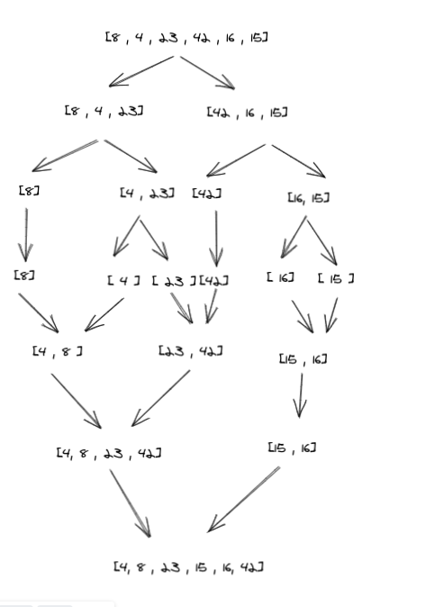

Sample Array =[8,4,23,42,16,15]

1- first of all the array is devided into smaller arrays ,left and right

2- these arrays are sorted from smaller to greater

3- comparing each element of the new arrays and merging them

