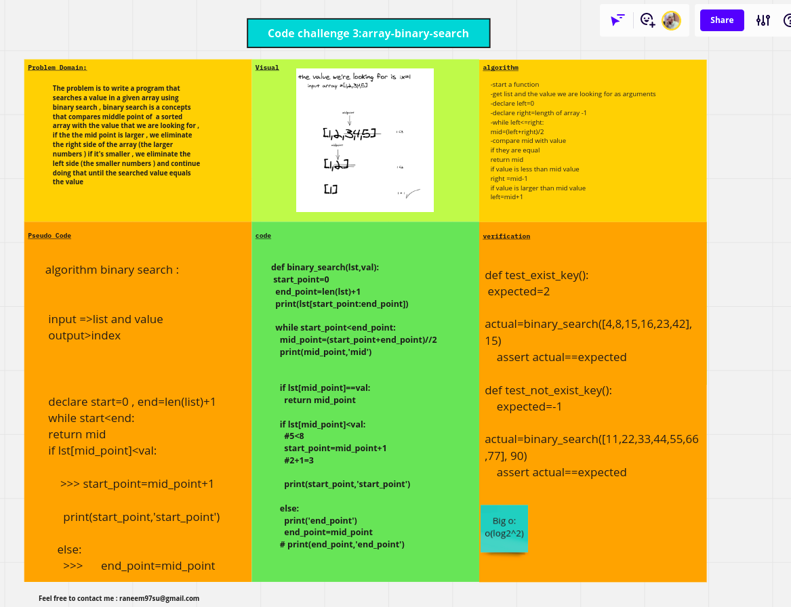

# Reverse an Array
The problem is to write a program that searches a value in a given array using binary search

# Challenge
search for a value in a give list using binary search

# Approach & Efficiency
I used simple while loop
# solution : here is the whiteboard

