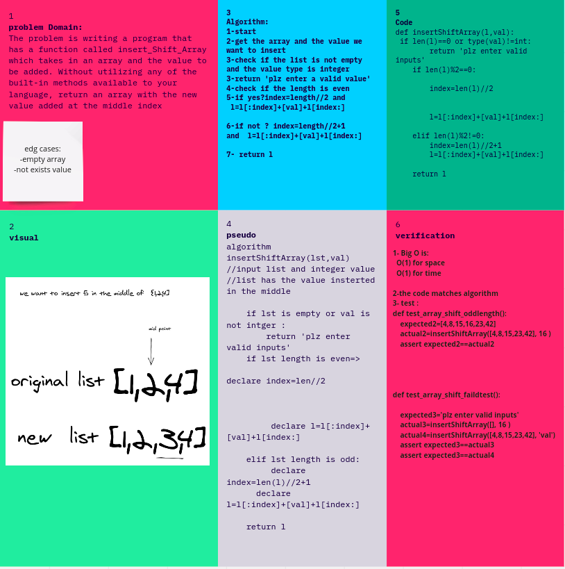

# Challenge Summary
<!-- Short summary or background information -->
we were asked to insert a value inside a middle of a list
## Challenge Description
<!-- Description of the challenge -->
this challenge requires to add a value inside the middle of the given list without using the built in

## Approach & Efficiency
<!-- What approach did you take? Why? What is the Big O space/time for this approach? -->
Big O(n)
space O(n)

## Solution
<!-- Embedded whiteboard image -->

