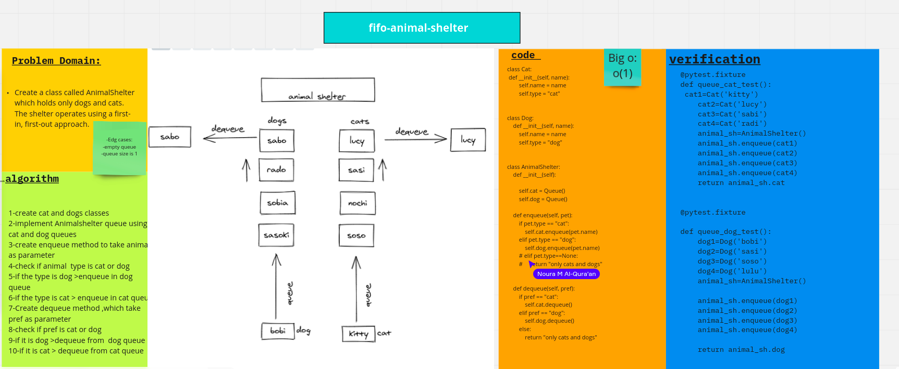

# Challenge Summary
the challenge is to queue pets in two queues dogs and cats
## Whiteboard Process

## Approach & Efficiency
Big o(1)
## Solution
<!-- Show how to run your code, and examples of it in action -->
[code](fifo_animal_shelter.py)

# collabration with :
Noura  
Manar 
Rawan
Tala 