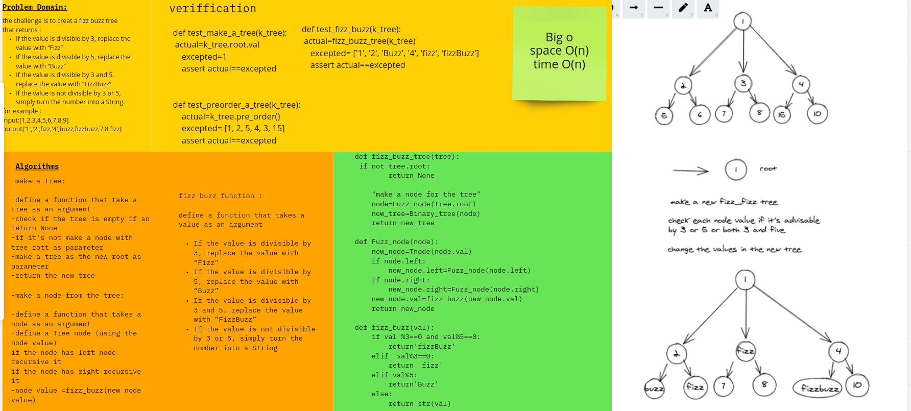

# Challenge Summary
write a function that returns a new tree after replacing the values as following 

structure as the original, but the values modified as follows:
If the value is divisible by 3, replace the value with “Fizz”
If the value is divisible by 5, replace the value with “Buzz”
If the value is divisible by 3 and 5, replace the value with “FizzBuzz”
If the value is not divisible by 3 or 5, simply turn the number into a String.
## Whiteboard Process

## Approach & Efficiency
<!-- What approach did you take? Why? What is the Big O space/time for this approach? -->
time: Big o(n)
space:Big o(n)
## Solution
[code](python/challenges/fizzbuzz_tree/fizz_buzz_tree.py)