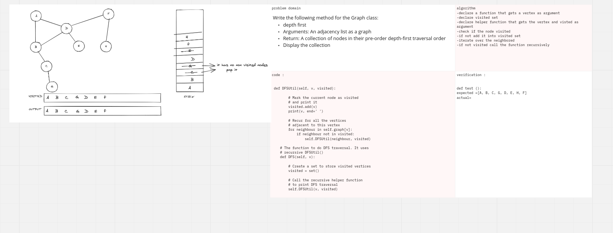

# Challenge Summary
Write the following method for the Graph class:

depth first
Arguments: An adjacency list as a graph
Return: A collection of nodes in their pre-order depth-first traversal order
Display the collection## Whiteboard Process

## Approach & Efficiency
Big o(1)
## Solution
<!-- Show how to run your code, and examples of it in action -->
[code](graph_depth_first.py)

