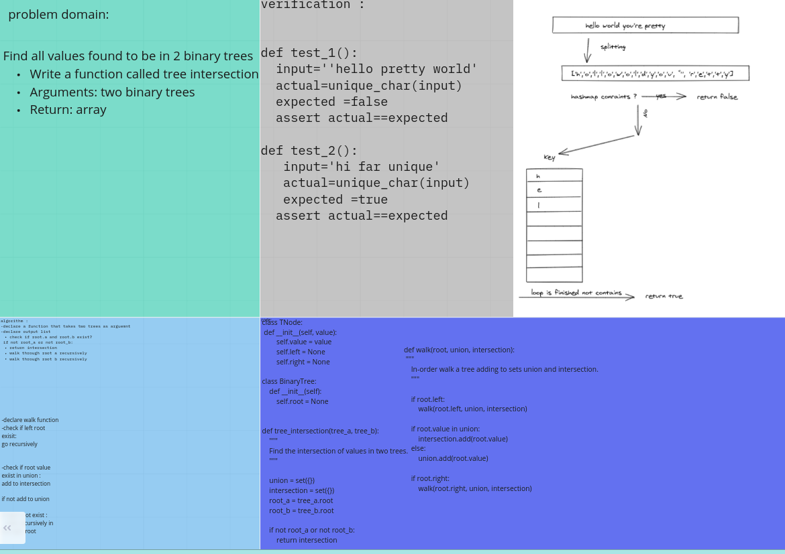

# Challenge Summary
Find all values found to be in 2 binary trees

Write a function called tree intersection
Arguments: two binary trees
Return: array
## Challenge Description
<!-- Description of the challenge -->
read two trees ,split it , add to hashmap , check if it's exist 

## Approach & Efficiency
<!-- What approach did you take? Why? What is the Big O space/time for this approach? -->
Big O(n)
space O(n)

## Solution
<!-- Embedded whiteboard image -->

