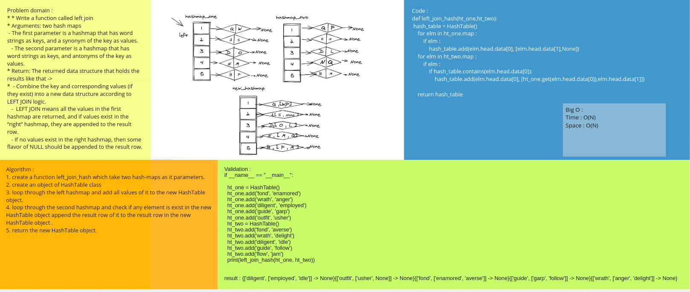

# Challenge Summary
the challenge is to join two hashmaps with respect to values
## Whiteboard Process

## Approach & Efficiency
Big o(1)
## Solution
<!-- Show how to run your code, and examples of it in action -->
[code](left_join.py)

# collabration with :
Noura  
Raneem