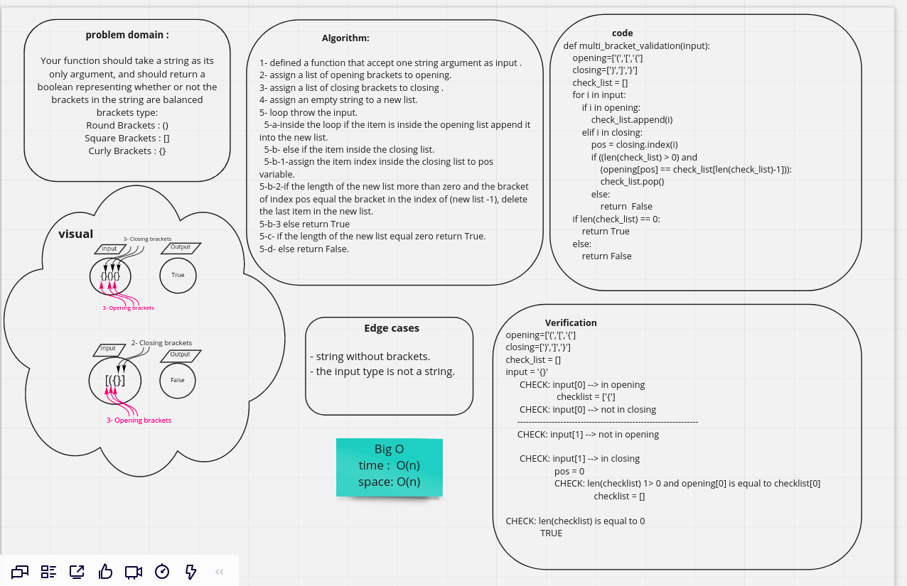

# Challenge Summary
Your function should take a string as its only argument, and should return a boolean representing whether or not the brackets in the string are balanced. There are 3 types of brackets:

Round Brackets : ()
Square Brackets : []
Curly Brackets : {}
## Whiteboard Process

## Approach & Efficiency
Big O
time O(n)
space O(n)
## Solution
[code](python/challenges/multi_bracket_validation/multi_bracket_validation.py)