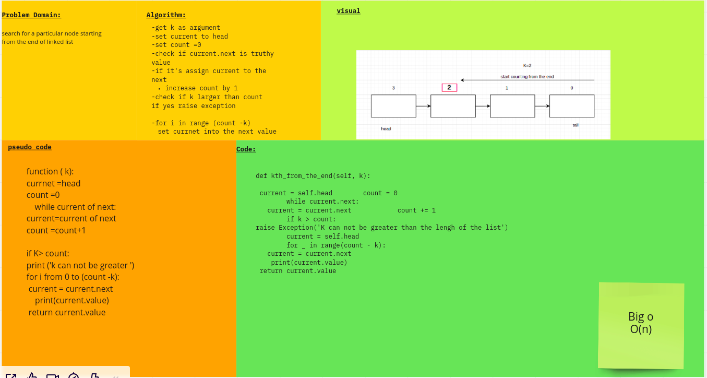

# Linked List
>a linear data structure, in which the elements are not stored at contiguous memory locations. These elements are called as nodes. Each node contains a data field and a reference (link) to the next node in the list.

# Challenge Summary
Make a linked list which we can add and search in .

# Check list

- [x] Can successfully instantiate an empty linked list

- [x]  Can properly insert into the linked list
- [x] The head property will properly point to the first node in the linked list

 - [x]Can properly insert multiple nodes into the linked list

 - [x]Will return true when finding a value within the linked list that exists

 - [x]Will return false when searching for a value in the linked list that does not exist

 - [x]Can properly return a collection of all the values that exist in the linked list

# White Board

