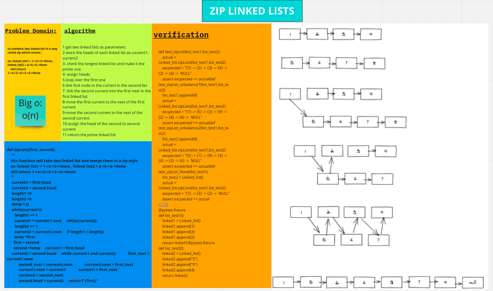

# Challenge Summary
this challenge is about combine two linke lists in zip way 
## Whiteboard Process

## Approach & Efficiency
<!-- What approach did you take? Why? What is the Big O space/time for this approach? -->
Big o(n)
## Solution
1-poetry install 
2-pytest 
