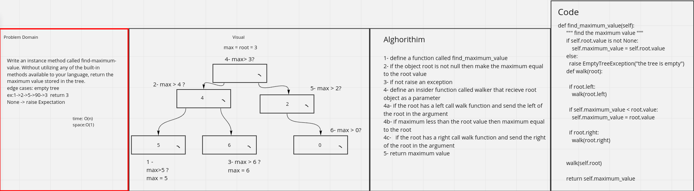

Challenge Summary
find maximuim value in a binary tree

Whiteboard Process

Approach & Efficiency
time:bigO(n) space:bigO(1)

Solution
[code](python/datastructures/tree/tree.py)

credits for :
Raneem
Manar 
Noura
Nour

