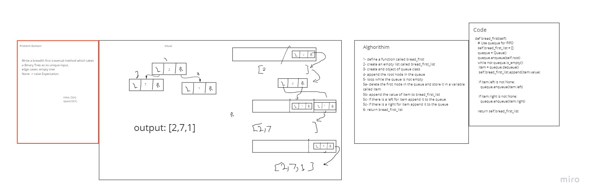

Challenge Summary
Write a breadth first traversal method which takes a Binary Tree as its unique input.

Whiteboard Process

Approach & Efficiency
speed:bigO(n) memory:bigO(n)

Solution
[code](python/datastructures/tree/tree.py)

credits for :
Raneem
Manar 
Noura
Nour

